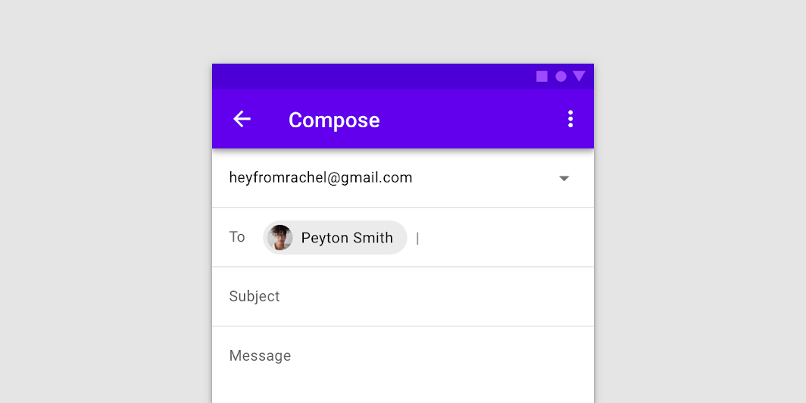

<!--docs:
title: "Material chips"
layout: detail
section: components
excerpt: "Chips are compact elements that represent an input, attribute, or action."
iconId: 
path: /catalog/material-chips/
-->

# Chips

[Chips](https://material.io/components/chips) are compact elements that represent an input, attribute, or action.

**Contents**

* [Using chips](#using-chips)
* [Installing chips](#installing-chips)
* [Importing chips](#importing-chips)
* [Making chips accessible](#making-chips-accessible)
* [Input chips](#input-chips)
* [Choice chips](#choice-chips)
* [Filter chips](#filter-chips)
* [Action chips](#action-chips)

## Using chips

Chips allow users to enter information, make selections, filter content, or trigger actions. While buttons are expected to appear consistently and with familiar calls to action, chips should appear dynamically as a group of multiple interactive elements.

### Installing chips

### Importing chips

### Making chips accessible

**Note to developers: List/describe any accessibility settings or attributes associated with chips**

## Types

There are four different types of chips, including [input](#input-chips), [choice](#choice-chips), [filter](#filter-chips), and [action](#action-chips).

### Input chips

Input chips represent a complex piece of information in compact form, such as an entity (person, place, or thing) or text. They enable user input and verify that input by converting text into chips.

### Choice chips

Choice chips allow selection of a single chip from a set of options.

Choice chips clearly delineate and display options in a compact area. They are a good alternative to toggle buttons, radio buttons, and single select menus.

### Filter chips

Filter chips use tags or descriptive words to filter content.

Filter chips clearly delineate and display options in a compact area. They are a good alternative to toggle buttons or checkboxes.

### Action chips

Action chips offer actions related to primary content. They should appear dynamically and contextually in a UI.

An alternative to action chips are buttons, which should appear persistently and consistently.

