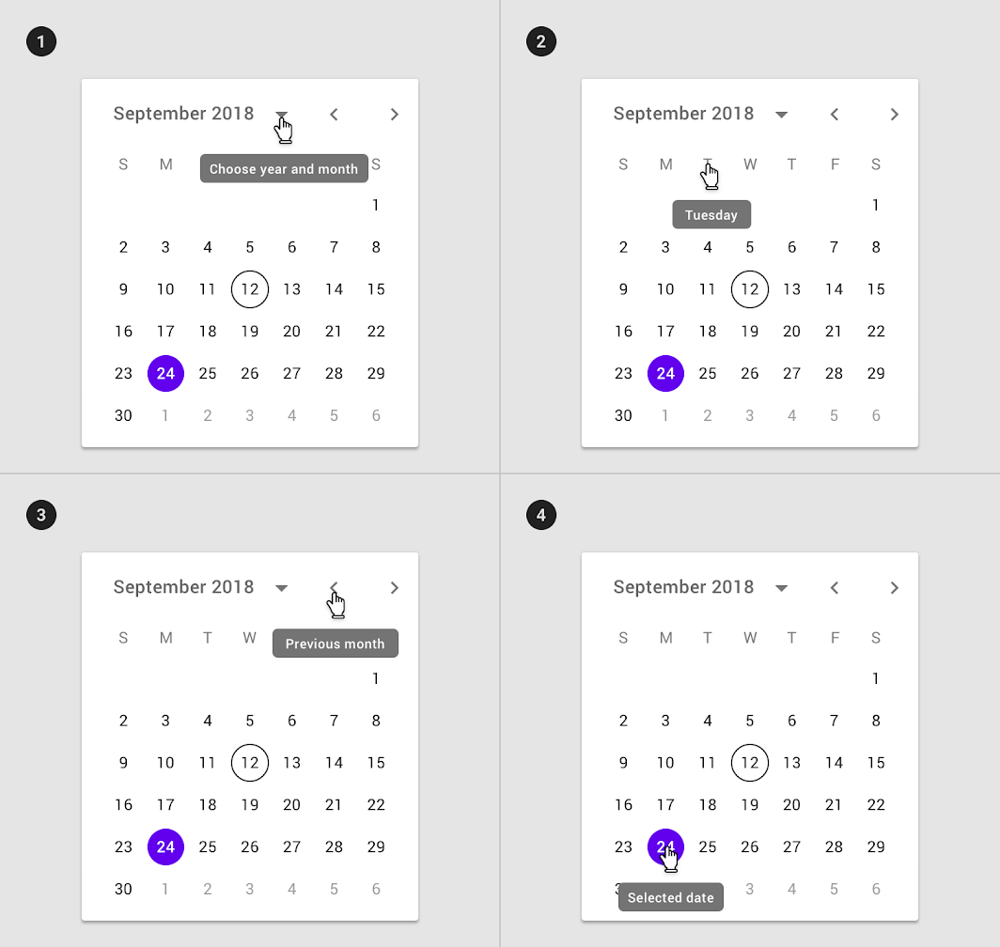

<!--docs:
title: "Material <component>"
layout: detail
section: components
excerpt: "Date pickers let users select a date or range of dates."
iconId: 
path: /catalog/date-pickers/
-->

# Date pickers

[Date pickers](https://material.io/components/date-pickers) let users select a date or range of dates. 

## Contents

**Note to developers: review the TOC contents to ensure that all rel links apply to your platform dev doc**

* [Using date pickers](#using-pickers)
* [Installing date pickers](#installing-pickers)
* [Making date pickers accessible](#making-pickers-accessible)
* [Mobile date pickers](#mobile-pickers)
* [Desktop date pickers](#desktop-pickers)
* [Theming date pickers](#theming-pickers)

## Using date pickers

Date pickers let users select a date or range of dates. They should be suitable for the context in which they appear.

Date pickers can be embedded into:

* Dialogs on mobile
* Text field dropdowns on desktop

## Installing date pickers

### Making date pickers accessible 

**Note to developers: include platform-specific accessibility information/settings**

## Anatomy and key properties

1. Title
2. Selected date
3. Switch-to-keyboard input icon
4. Year selection menu
5. Month pagination
6. Current date
7. Selected date

## Mobile date pickers

Mobile date pickers can be used to select dates in the near future or past, when it’s useful to see them in a calendar month format. They are displayed in a dialog.

Common use cases include:

Making a restaurant reservation
Scheduling a meeting
They aren’t ideal for selecting dates in the distant past or future that require more navigation, such as entering a birth date or expiration date.

Mobile date pickers allow selection of a single date and year.

### Mobile date pickers example

**Note to developers: provide code and a screenshot an example mobile date picker with the following:**
* A title that reads "Select a date"
* A selected date in the format "\<day of the week\>, \<month\>, \<year\>"
* A switch-to-keyboard input icon
* A year selection menu
* Month pagination
* Current date
* Selected date (your choice)

## Desktop date pickers

Desktop date pickers allow the selection of a specific date and year. The desktop date picker displays a date input field by default, and a dropdown date appears when the user taps on the input field. The user can interact with either form of date entry.

Desktop date pickers are ideal for navigating dates in both the near future (or past) and the distant future (or past), as they provide multiple ways to select dates.

Desktop date pickers supports tooltips to provide users additional instructions to use date pickers.

1. Tooltip used on month and year selector
2. Tooltip on day selector
3. Tooltip used on month pagination control
4. Tooltip used on selected date

### Desktop date pickers example

**Note to developers: provide code and a screenshot an example desktop date picker with the following:**
* A title that reads "Select a date"
* A selected date in the format "\<day of the week\>, \<month\>, \<year\>"
* A switch-to-keyboard input icon
* A year selection menu
* Month pagination
* Current date
* Selected date (your choice)

## Theming date pickers

_Use the [Shrine theme](https://material.io/design/material-studies/shrine.html) for this example_

**Note to developers: provide code and a screenshot an example mobile date picker with the following:**
* A title that reads "Select a date"
* A selected date in the format "\<day of the week\>, \<month\>, \<year\>"
* A switch-to-keyboard input icon
* A year selection menu
* Month pagination
* Current date
* Selected date (your choice)

