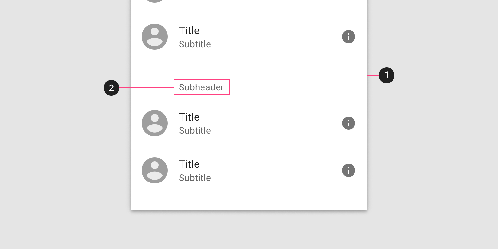
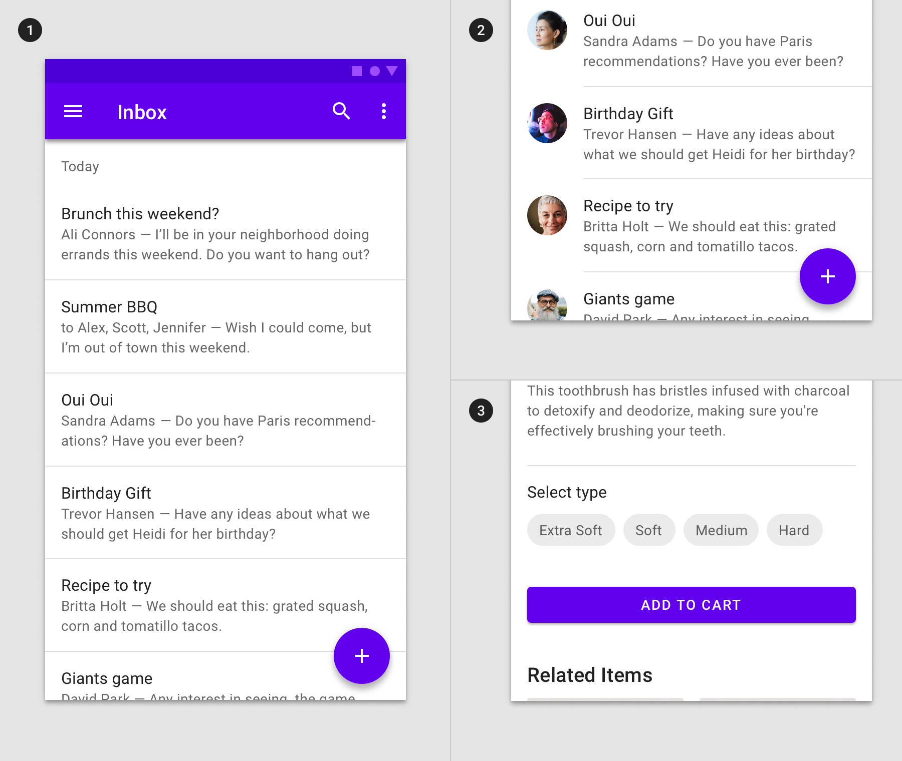

<!--docs:
title: "Material dividers"
layout: detail
section: components
excerpt: "A divider is a thin line that groups content in lists and layouts."
iconId: 
path: /catalog/material-dividers/
-->

# Dividers

A [divider](https://material.io/components/dividers) is a thin line that groups content in lists and layouts.

**Contents**

* [Using dividers](#using-dividers)
* [Installing dividers](#installing-dividers)
* [Making dividers accessible](#making-dividers-accessible)
* [Full-bleed dividers](#full-bleed-dividers)
* [Inset dividers](#inset-dividers)
* [Middle dividers](#middle-dividers)
* [Theming dividers](#theming-dividers)

## Installing dividers

_**Note to developers: add any installtion instructions here**_

## Making dividers accessible

_**Note to developers: add any accessibility information here**_

## Anatomy and key properties

The following shows the anatomy of a divider:

1. Divider
1. Subheader

### Divider

| &nbsp; | Property | 
| --- | --- | 

### Subheader

| &nbsp; | Property | 
| --- | --- | 

**Types**

There are 3 types of dividers: 1\. [full-bleed](#full-bleed-dividers), 2\. [inset dividers](#inset-dividers), 3\. [middle dividers](#middle-dividers).

### Full-bleed dividers

Full-bleed dividers separate content into sections and span the entire length of a layout.

#### Full-bleed dividers example

`Divider`
* [Class definition](https://api.flutter.dev/flutter/material/Divider-class.html)
* [GitHub source](https://github.com/flutter/flutter/blob/master/packages/flutter/lib/src/material/divider.dart)
* [Demo site](demo site here)

The following example shows a list with full-bleed dividers:

_**Note to developers: Add code and a screenshot that shows the following:**_
* A list of text items, labeled "Item 1", "Item 2"..."Item n"
* Each item is separated by a full-bleed divider

### Inset dividers

Inset dividers separate related content, anchored by elements that align with the app bar title.

#### Inset divider example

`Divider`
* [Class definition](https://api.flutter.dev/flutter/material/Divider-class.html)
* [GitHub source](https://github.com/flutter/flutter/blob/master/packages/flutter/lib/src/material/divider.dart)
* [Demo site](demo site here)

The following example shows two lists separated by an inset divider and a subheader

_**Note to developers: Add code and a screenshot that shows the following:**_
* Two lists text lists divided by an inset divider
* List A has 3 items: "A1," "A2," "A3"
* List B has 3 items: "B1," "B2," "B3"
* The subheader for List B is "Subheader"

### Middle dividers

Middle dividers space related content and are centered in a layout or list.

#### Middle divider example

`Divider`
* [Class definition](https://api.flutter.dev/flutter/material/Divider-class.html)
* [GitHub source](https://github.com/flutter/flutter/blob/master/packages/flutter/lib/src/material/divider.dart)
* [Demo site](demo site here)

The following example shows a middle divider separating a list of items and their prices and the total cost:

_**Note to developers: show a list of items separated from a total by a middle divider**_
* A list of text items, labeled "Item 1", "Item 2"..."Item n"
* Each item in the list has a price: "Item 1" -\> "$1", "Item 2" -\> "$2" ... "Item n" -\> "$n"
* Below the middle divider is the total

## Theming dividers

`Divider`
* [Class definition](https://api.flutter.dev/flutter/material/Divider-class.html)
* [GitHub source](https://github.com/flutter/flutter/blob/master/packages/flutter/lib/src/material/divider.dart)
* [Demo site](demo site here)

The following shows an inset divider with [Shrine theming](https://material.io/design/material-studies/shrine.html):

_**Note to developers: Add code and a screenshot that shows the following usign [Shrine theming](https://material.io/design/material-studies/shrine.html):**_
* Two lists text lists divided by an inset divider
* List A has 3 items: "A1," "A2," "A3"
* List B has 3 items: "B1," "B2," "B3"
* The subheader for List B is "Subheader"

