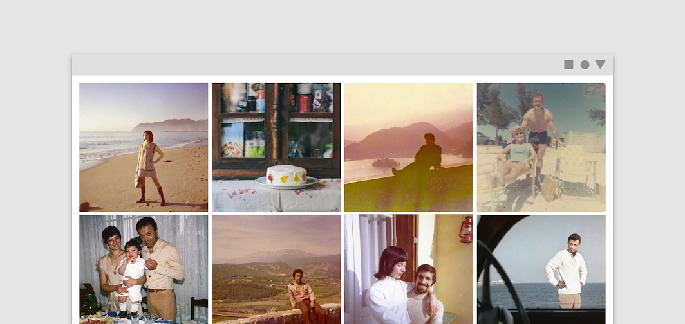

<!--docs:
title: "Image lists"
layout: detail
section: components
excerpt: "Image lists display a collection of images in an organized grid."
iconId:
path: /catalog/imagelists/
-->

# Image lists

[Image lists](https://material.io/components/image-lists) display a collection of images in an organized grid.

**Contents**

* [Using image lists](#using-image-lists)
* [Installing image lists](#installing-image-lists)
* [Making image lists accessible](#making-image-lists-accessible)
* [Standard image lists](#standard-image-lists)
* [Quilted image lists](#quilted-image-lists)
* [Woven image lists](#woven-image-lists)
* [Masonry image lists](#masonry-image-lists)
* [Theming image lists](#theming-image-lists)

## Using image lists

Image lists represent a collection of items in a repeated pattern. They help improve the visual comprehension of the content they hold.

### Installing image lists

### Making image lists accessible

## Anatomy and key properties

The following is an anatomy diagram of an image list:

An image list consists of the following item:

1. Image container
2. Text labels (optional)
3. Actionable iconography (optional)
4. Text protection (optional)
5. Image list item

### Image container

### Text labels

### Actionalble iconography

### Text protection

### Image list item

## Types

There are four types of image lists: 1\. [Standard image lists](#standard-image-lists) are best for items of equal importance. They have a uniform container size, ratio, and padding. 2\. [Quilted image lists](#quilted-image-lists) emphasize certain items over others in a collection. They create hierarchy using varied container sizes and ratios 3\. [Woven image lists](#woven-image-lists) facilitate the browsing of peer content. They display content in containers of varying ratios to create a rhythmic layout. 4\. [Masonry image lists](#masonry-image-lists) facilitate the browsing of uncropped peer content. Container heights are sized based on the image size.

### Standard image lists

Standard image lists are best for items of equal importance. They have a uniform container size, ratio, and padding.

#### Standard image list example

` `
* [Class description](something something)
* [GitHub source](something something)

**Note to developers: provide code and a screenshot of a standard image list with the following:**
* Show images `assets/ImageList_1.jpg` ... `assets/ImageList_6.jpg`

### Quilted image lists

Quilted image lists emphasize certain items over others in a collection. They use varied container sizes and ratios to create hierarchy across images.

#### Quilted image list example

` `
* [Class description](something something)
* [GitHub source](something something)

**Note to developers: provide code and a screenshot of a quilted image list with the following:**
* Show images `assets/ImageList_1.jpg` ... `assets/ImageList_6.jpg`
* Make `ImageList_1.jpg` twice the height/length of the other images
* Label each image "Image 1" ... "Image 6"

### Woven image lists

Woven image lists use alternating container ratios to create a rhythmic layout. A woven image list is best for browsing peer content.

#### Woven image list example

` `
* [Class description](something something)
* [GitHub source](something something)

**Note to developers: provide code and a screenshot of a woven image list with the following:**
* Show images `assets/ImageList_1.jpg` ... `assets/ImageList_6.jpg`

### Masonry image lists

Masonry image lists use dynamically sized container heights that reflect the aspect ratio of each image. This image list is best used for browsing uncropped peer content.

#### Masonry image list example

` `
* [Class description](something something)
* [GitHub source](something something)

**Note to developers: provide code and a screenshot of a masonry image list with the following:**
* Show images `assets/ImageList_1.jpg` ... `assets/ImageList_6.jpg`
* Label each image "Image 1" ... "Image 6"

#### Theming image lists

` `
* [Class description](something something)
* [GitHub source](something something)

The following shows a quilted image list with [Shrine](https://material.io/design/material-studies/shrine.html) theming:

**Note to developers: provide code and a screenshot of a quilted image list using [Shrine](https://material.io/design/material-studies/shrine.html) theming with the following:**
 Show images `assets/ImageList_1.jpg` ... `assets/ImageList_6.jpg`
* Make `ImageList_1.jpg` twice the height/length of the other images
* Label each image "Image 1" ... "Image 6"

