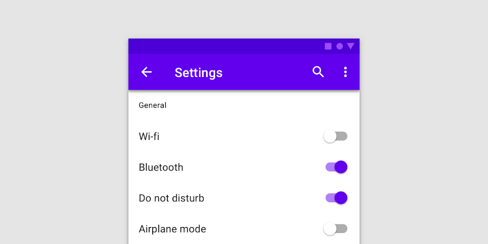
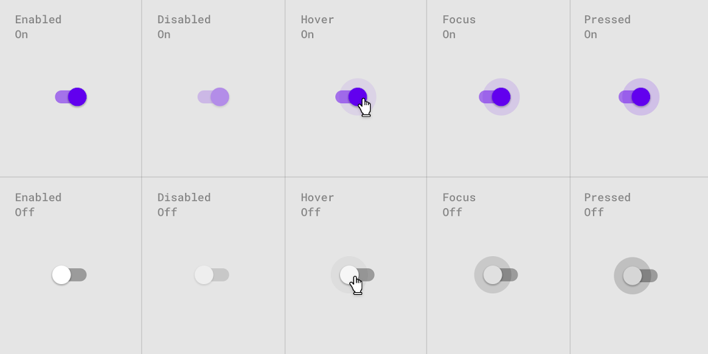

<!--docs:
title: "Material selection controls: Switches"
layout: detail
section: components
excerpt: "Selection controls allow the user to select options."
iconId: 
path: /catalog/SelectionControlSwitches/
-->

# Selection controls: switches

[Selection controls](https://material.io/components/selection-controls#usage) allow the user to select options.

Switches toggle the state of a single setting on or off. They are the preferred way to adjust settings on mobile.

**Contents**

* [Using switches](#using-radio-buttons)
* [Making switches accessible](#making-radio-buttons-accessible)
* [Switch anatomy](#switch-anatomy)
* [Switch example](#switch-example)
* [Theming](#theming)

## Using switches

Use switches to:

* Toggle a single item on or off, on mobile and tablet
* Immediately activate or deactivate something

### Making switches accessible

## Switch Anatomy

The following is an anatomy diagram that shows a switch thumb and a switch track:

1. Thumb
1. Track

### Thumb attributes

&nbsp; | Attribute | Related method(s) | Default value
------ | --------- | ----------------- | -------------

### Track attributes

&nbsp; | Attribute | Related method(s) | Default value
------ | --------- | ----------------- | -------------

## Switches example

`SwitchMaterial`
* [Class definition](https://developer.android.com/reference/android/support/v7/widget/SwitchCompat)
* [GitHub source](https://github.com/material-components/material-components-android/tree/master/lib/java/com/google/android/material/switchmaterial/SwitchMaterial.java)

**Note to developers: Generate example code and a screenshot of the code render showing the following:**
* Provide a list of 5 switches
* Each switch is followed by text: "Switch 1" "Switch 2"... "Switch 5"
* "Switch 5" should be disabled

### Switch states

Switches can be on or off. Switches have enabled, hover, focused, and pressed states.

Display the outer radial reaction only on form factors that use touch, where interaction may obstruct the element completely.

For desktop, the radial reaction isn't needed.

## Theming

`SwitchMaterial`
* [Class definition](https://developer.android.com/reference/android/support/v7/widget/SwitchCompat)
* [GitHub source](https://github.com/material-components/material-components-android/tree/master/lib/java/com/google/android/material/switchmaterial/SwitchMaterial.java)

Switches support [Material Theming](https://material.io/components/buttons/#theming) and can be
customized in terms of color, typography and shape.

**Note to developers: Generate example code and a screenshot of the code render showing the following with [Shrine theming](https://material.io/design/material-studies/shrine.html#when-to-adapt):**
* Provide a list of 5 switches
* Each switch is followed by text: "Switch 1" "Switch 2"... "Switch 5"
* "Switch 5" should be disabled

