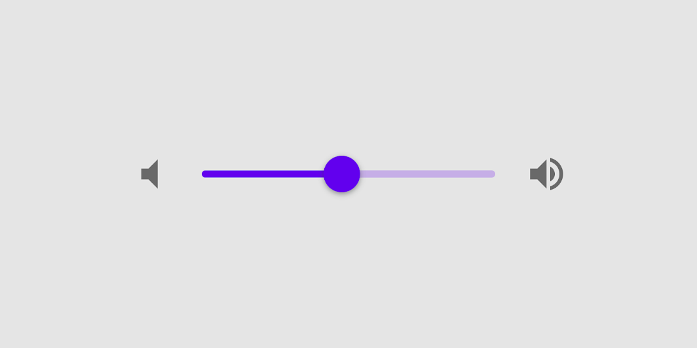

<!--docs:
title: "Sliders"
layout: detail
section: components
excerpt: "Sliders allow users to make selections from a range of values."
iconId: slider
path: /catalog/sliders/
-->

# Slider

[Sliders](https://material.io/components/sliders/) allow users to make
selections from a range of values.

## Contents

*   [Using sliders](#using-sliders)
*   [Continuous slider](#continuous-slider)
*   [Discrete slider](#discrete-slider)
*   [Theming sliders](#theming-sliders)

## Using sliders

### Installing sliders

### Making sliders accessible

## Types

There are two types of sliders: 1\. [Continuous slider](#continuous-slider) and 2\.
[Discrete slider](#discrete-slider)

A slider with one thumb is called a single point slider, and a slider with two thumbs is called a range slider.
### Anatomy and key properties

A slider has a track, one or two thumbs, and optional value label. A discrete
slider also has tick marks.

1.  Track
2.  Thumb
3.  Value label (optional)
4.  Tick mark (discrete sliders)

#### Track attributes

&nbsp;                                  | Attribute                | Related method(s)                                         | Default value
--------------------------------------- | ------------------------ | --------------------------------------------------------- | -------------

#### Thumb attributes

&nbsp;          | Attribute            | Related method(s)                                                           | Default value
--------------- | -------------------- | --------------------------------------------------------------------------- | -------------

#### Value label attributes

&nbsp;        | Attribute           | Related method(s)                           | Default value
------------- | ------------------- | ------------------------------------------- | -------------

#### Tick mark attributes

&nbsp;                              | Attribute               | Related method(s)                                       | Default value
----------------------------------- | ----------------------- | ------------------------------------------------------- | -------------

### Continuous sliders

Continuous sliders allow users to make meaningful selections that don’t require
a specific value.

#### Continuous single point slider example

API and source code:

*   ``
    *   [Class definition]()
    *   [Class source]()

**Note to developers: Provide a continuous single point slider example with code and screenshot with the following:**
* A track range from 0 to 100
* A thumb set to 70

#### Continuous range slider example

API and source code:

*   ``
    *   [Class definition]()
    *   [Class source]()

**Note to developers: Provide a continuous range slider example with code and screenshot with the following:**
* A track range from 0 to 100
* A lower-bound thumb set to 20
* An upper-bound thumb set to 70

### Discrete sliders

Discrete sliders display a numeric value label upon pressing the thumb, which
allows a user to input an exact value.

#### Discrete single point slider example

API and source code:

*   ``
    *   [Class definition]()
    *   [Class source]()

**Note to developers: Provide a discrete single point slider example with code and screenshot with the following:**
* A track range from 0 to 100
* A thumb set to 70
* Tick marks set at 10

#### Discrete range slider example

API and source code:

*   ``
    *   [Class definition]()
    *   [Class source]()

**Note to developers: Provide a discrete range slider example with code and screenshot with the following:**
* A track range from 0 to 100
* A lower-bound thumb set to 20
* An upper-bound thumb set to 70
* Tick marks set at 10

## Theming sliders

Sliders support
[Material Theming](https://material.io/components/sliders#theming) and can be
customized in terms of color and typography.

### Slider theming example

API and source code:

*   ``
    *   [Class definition]()
    *   [Class source]()
*   ``
    *   [Class definition]()
    *   [Class source]()

The following example shows a discrete range slider with Material's [Shrine](https://material.io/design/material-studies/shrine.html) theme.

**Note to developers: Provide a discrete range slider example that uses Shrine theming with code and screenshot with the following:**
* A track range from 0 to 100
* A lower-bound thumb set to 20
* An upper-bound thumb set to 70
* Tick marks set at 10

