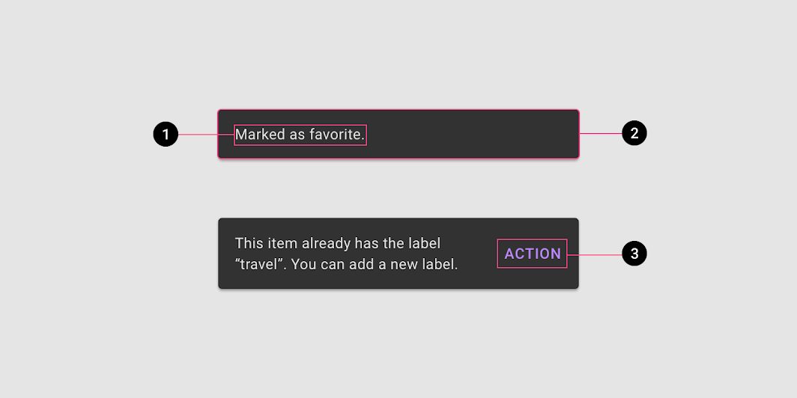

<!--docs:
title: "Material Snackbars"
layout: detail
section: components
excerpt: "Snackbars provide brief messages about app processes at the bottom of the screen."
iconId: 
path: /catalog/Snackbars/
-->

# Snackbars

[Snackbars](https://material.io/components/snackbars) provide brief messages about app processes at the bottom of the screen.

**Contents**

**Note to developers: review the TOC contents to ensure that all rel links apply to your platform dev doc**

* [Importing snackbars](#importing-snackbars)
* [Making snackbars accessible](#making-snackbars-accessible)
* [Snackbars example](#snackbar-example)
* [Theming snackbars](#theming-snackbars)

## Using snackbars

Snackbars inform users of a process that an app has performed or will perform. They appear temporarily, towards the bottom of the screen. They shouldn’t interrupt the user experience, and they don’t require user input to disappear.

### Making snackbars accessible

**Note to developers: include platform-specific accessibility information/settings**

## Snackbars anatomy and key properties

The following is an anatomy diagram of a snackbar:

1. Text label
1. Container
1. Action (optional)

### Text label properties

| &nbsp; | Property |
|---|---|
| **Text label** | | 
| **Text color** | |
| **Typography** | | 

### Container properties

&nbsp; | Property
------ | --------- 
**Color** |  
**Height** |  
**Overlay window** |

### Action properties

&nbsp;         | Property
-------------- | ------------------------ 
 | 

## Snackbars example

`SnackBar`
* [Class definition](https://api.flutter.dev/flutter/material/SnackBar-class.html)
* [GitHub source](https://github.com/flutter/flutter/blob/fabf4e3d0d311181178d2c601d29a2f739ea543a/packages/flutter/lib/src/material/snack_bar.dart)

The following is an example of a snackbar with an action button:

**Note to developers: Provide code source and a screenshot that shows a snackbar with**

* A text label that reads "Text label"
* A container with a background image:
    
* A text button with a label "Action"

## Theming example

`SnackBar`
* [Class definition](https://api.flutter.dev/flutter/material/SnackBar-class.html)
* [GitHub source](https://github.com/flutter/flutter/blob/fabf4e3d0d311181178d2c601d29a2f739ea543a/packages/flutter/lib/src/material/snack_bar.dart)

The following is an example of a snackbar with an action button that uses the Material.io [Shrine](https://material.io/design/material-studies/shrine.html) color theming::

**Note to developers: Provide code source and a screenshot that shows a snackbar with Material.io [Shrine](https://material.io/design/material-studies/shrine.html) color theming:**

* A text label that reads "Text label"
* A container with a background image:
    
* A text button with a label "Action"
