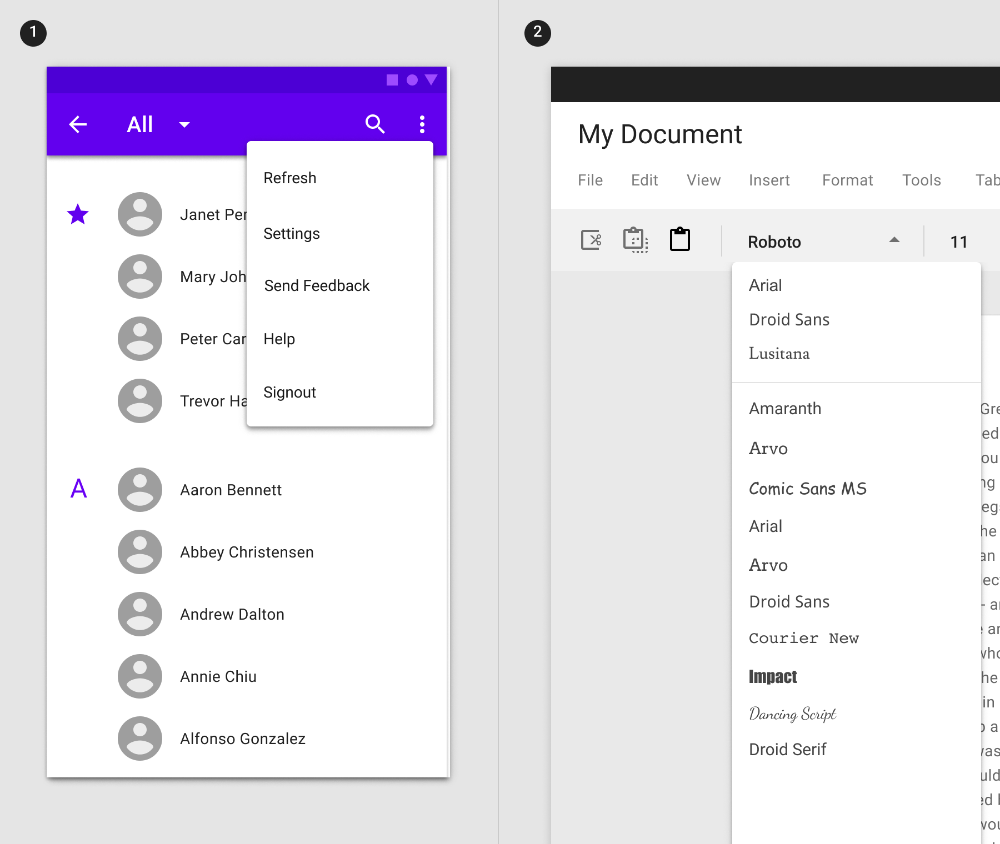

<!--docs:
title: "Menus"
layout: detail
section: components
excerpt: "Menus display a list of choices on temporary surfaces."
iconId: 
path: /catalog/menus/
api_doc_root: true
-->

# Menus

[Menus](https://material.io/components/menus/#) display a list of choices on temporary surfaces.

# Contents

* [Using menus](#using-menus)
* [Installing menus](#installing-menus)
* [Making menus accessible](#making-menus-accessible)
* [Dropdown menus](#dropdown-menus)
* [Exposed dropdown menus](#exposed-dropdown-menus)

## Using menus

A menu displays a list of choices on a temporary surface. They appear when users interact with a button, action, or other control.

### Installing menus

### Styles

### Javascript instantiation

### Making menus accessible

## Types

Menus allow users to make a selection from multiple options. They are less prominent and take up less space than selection controls, such as a set of radio buttons.

There are two types of menus: 1\. [dropdown menus](#dropdown-menus), 2\. [exposed dropdown menus](#exposed-dropdown-menus).

### Dropdown menus

Dropdown menus display a list of options, triggered by an icon, button, or action. Their placement varies based on the element that opens them.

### Exposed dropdown menus

Exposed dropdown menus display the currently selected menu item above the list of options. Some variations can accept user-entered input.

