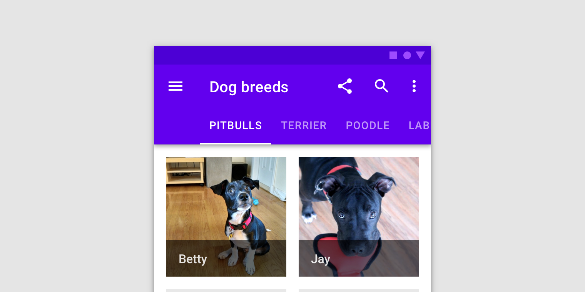

<!--docs:
title: "Tabs"
layout: detail
section: components
excerpt: "Tabs organize and allow navigation between groups of content that are related and at the same level of hierarchy."
iconId:
path: /catalog/tabs
-->

# Tabs

[Tabs](https://material.io/components/tabs/) organize content across different screens, data sets, and other interactions.

There are two types of tabs:
1. [Fixed tabs](#fixed-tabs)
1. [Scrollable tabs](#scrollable-tabs)

 

1. 
1. 

## Using tabs

Tabs organize and allow navigation between groups of content that are related and at the same level of hierarchy.

### Making tabs accessible

## Anatomy and key properties

1. Container
1. Active icon (Optional if there’s a label)
1. Active text label (Optional if there’s an icon)
1. Active tab indicator
1. Inactive icon (Optional if there’s a label)
1. Inactive text label (Optional if there’s an icon)
1. Tab item

### Container attributes

&nbsp; | Attribute | Related method(s) | Default value
------ | --------- | ----------------- | -------------
**Color** | `app:background` | N/A | 
**Height** | `app:height` | N/A | 
**Overlay window** | `app:windowActionModeOverlay` (in app theme) | N/A | 

### Active  icon attributes

&nbsp; | Attribute | Related method(s) | Default value
------ | --------- | ----------------- | -------------
**`MaterialToolbar` icon** | `app:navigationIcon` | `setNavigationIcon` `getNavigationIcon` |
**`MaterialToolbar` icon color** | N/A | N/A | 

### Active text label attributes

&nbsp;         | Attribute                | Related method(s)                 | Default value
-------------- | ------------------------ | --------------------------------- | -------------
**Text label** | `android:text`           | `setText` `getText`           | 
**Color**      | `android:textColor`      | `setTextColor` `getTextColor` | 
**Typography** | `android:textAppearance` | `setTextAppearance`               | 

### Active tab indicator attributes

### Inactive  icon attributes

&nbsp; | Attribute | Related method(s) | Default value
------ | --------- | ----------------- | -------------
**`MaterialToolbar` icon** | `app:navigationIcon` | `setNavigationIcon` `getNavigationIcon` |
**`MaterialToolbar` icon color** | N/A | N/A | 

### Inactive text label attributes

&nbsp;         | Attribute                | Related method(s)                 | Default value
-------------- | ------------------------ | --------------------------------- | -------------
**Text label** | `android:text`           | `setText` `getText`           | 
**Color**      | `android:textColor`      | `setTextColor` `getTextColor` | 
**Typography** | `android:textAppearance` | `setTextAppearance`               | 

### Tab item attributes

## Fixed tabs

Fixed tabs display all tabs on one screen, with each tab at a fixed width. The width of each tab is determined by dividing the number of tabs by the screen width. They don’t scroll to reveal more tabs; the visible tab set represents the only tabs available.

### Fixed tab example

`TabLayout`
* [Class definition](https://developer.android.com/reference/com/google/android/material/tabs/TabLayout)
* [GitHub source](https://github.com/material-components/material-components-android/blob/master/lib/java/com/google/android/material/tabs/TabLayout.java)

The following example shows a row of of fixed tabs.

**Note to developers: Create a code example and screenshot with the following**
* A fixed row of three tabs, labeled:
    * "Tab 1"
    * "Tab 2"
    * "Tab 3"
* Tab 1 has a favorites icon
* Tab 2 has a music icon
* Tab 3 has a search icon
* Screenshot only: Tab 2 is shown as selected

## Scrollable tabs

Scrollable tabs are displayed without fixed widths. They are scrollable, such that some tabs will remain off-screen until scrolled.### Fixed tab example

`TabLayout`
* [Class definition](https://developer.android.com/reference/com/google/android/material/tabs/TabLayout)
* [GitHub source](https://github.com/material-components/material-components-android/blob/master/lib/java/com/google/android/material/tabs/TabLayout.java)

The following example shows a row of of scrollable tabs.

**Note to developers: Create a code example and screenshot with the following**
* A scrollable row of five tabs, labeled:
    * "Tab 1"
    * "Tab 2"
    * "Tab 3"
    * "Tab 4"
    * "Tab 5"
* The screen shows only 3 tabs
* Screenshot only: Tab 3 is selected.

## Theming tabs

`TabLayout`
* [Class definition](https://developer.android.com/reference/com/google/android/material/tabs/TabLayout)
* [GitHub source](https://github.com/material-components/material-components-android/blob/master/lib/java/com/google/android/material/tabs/TabLayout.java)

The following example shows a row of of scrollable tabs.

**Note to developers: Create a code example using [Shrine](https://material.io/design/material-studies/shrine.html) theming with the following features:**

* A scrollable row of five tabs, labeled:
    * "Tab 1"
    * "Tab 2"
    * "Tab 3"
    * "Tab 4"
    * "Tab 5"
* The screen shows only 3 tabs
* Screenshot only: Tab 3 is selected.

