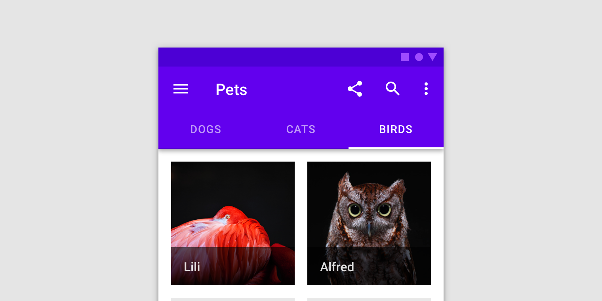

<!--docs:
title: "Tabs"
layout: detail
section: components
excerpt: "Tabs organize and allow navigation between groups of content that are related and at the same level of hierarchy."
iconId:
path: /catalog/tabs
-->

# Tabs

[Tabs](https://material.io/components/tabs/) organize content across different screens, data sets, and other interactions.

There are two types of tabs:
1. [Fixed tabs](#fixed-tabs)
1. [Scrollable tabs](#scrollable-tabs)

 

1. 
1. 

## Using tabs

Tabs organize and allow navigation between groups of content that are related and at the same level of hierarchy.

### Installation

### Styles

### JavaScript Instantiation 

### Making tabs accessible

## Fixed tabs

Fixed tabs display all tabs on one screen, with each tab at a fixed width. The width of each tab is determined by dividing the number of tabs by the screen width. They don’t scroll to reveal more tabs; the visible tab set represents the only tabs available.

## Scrollable tabs

Scrollable tabs are displayed without fixed widths. They are scrollable, such that some tabs will remain off-screen until scrolled.### Fixed tab example

